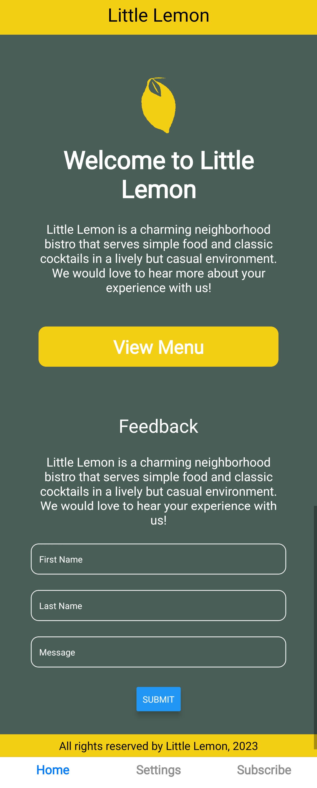
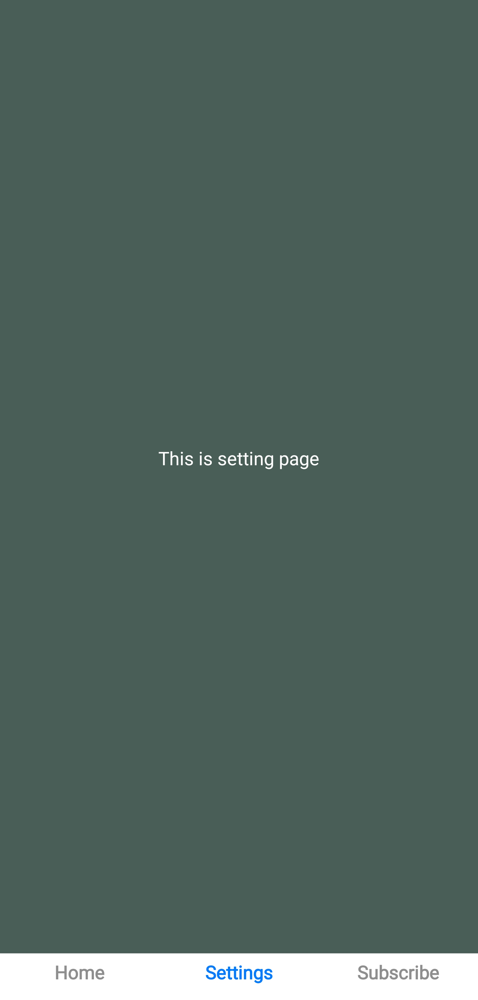
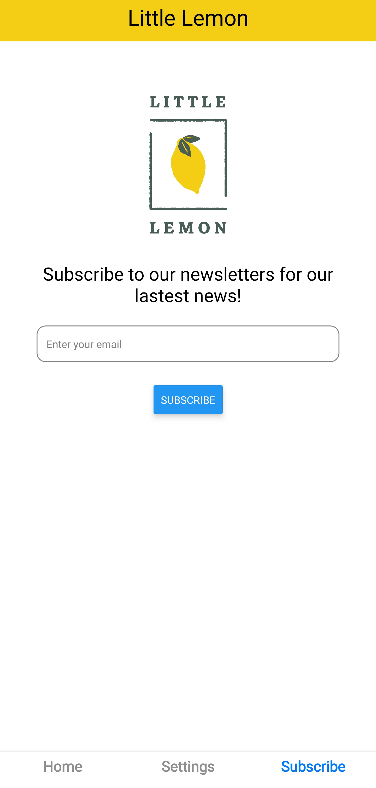
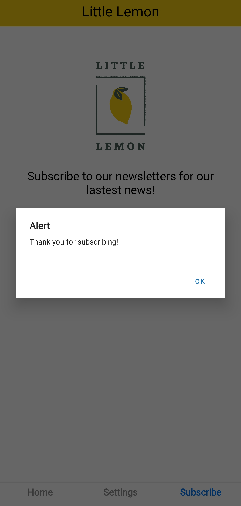

# Course 5: React Native

Refer to the [course syllabus](./README.md).

This course project involves building a subscription page for the Little Lemon app. 

Refer to the [detailed instructions](./instructions5.md).

Complete files refer to the [folder](./LittleLemonApp/). Note that this entire course is built on an app for Little Lemon, and I built it as the course progresses. Ultimately, I added a subscription feature to this app. The folder contains both content for the Little Lemon app, including build content, as well as the course and final assignments. 

To run the app on your local machine, use the `cd` switch to navigate to the `LittleLemonApp` folder, and run `npm install` and `npm start` or `npm run web` to start the app. 

Alternatively, you can download the [zip file](./Litter%20Lemon%20App.zip), unzip it, and run `npm start` or `npm run web` to start the app.

## App Preview

This app contains three pages: Home, Settings and Subscribe.

<table>
    <tr>
        <td></td>
        <td></td>
        <td></td>
    </tr>
</table>

For the subscribe page, it has built-in email validation: if the email is valid, an error message is displayed; if the email is invalid, the subscription is successful. 

<table>
    <tr>
        <td></td>
        <td></td>
    </tr>
</table>