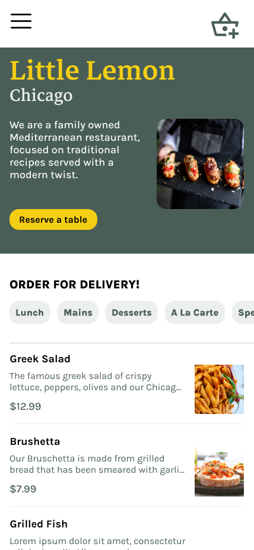

# Course 7: Principles of UX/UI Design

Refer to the [course syllabus](./syllabus7.md).

This course project utilizes Figma to design a "reverse a table" page for the Little Lemon app. The other page shown in preview, such as "Home," is given by the course. 

Refer to the [detailed instructions](./instructions7.md).

Complete files refer to the [folder](./Design/)(must open using Figma).

## Preview

Preview all pages: 

Individual page

<table>
    <tr>
        <td></td>
        <td></td>
    </tr>
</table>

<table>
    <tr>
        <td></td>
        <td></td>
    </tr>
</table>

