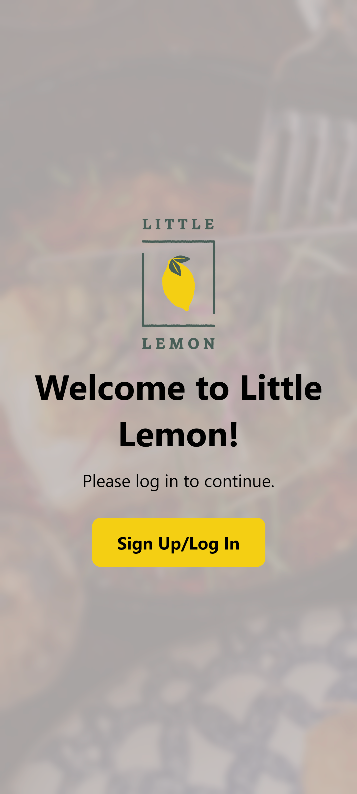
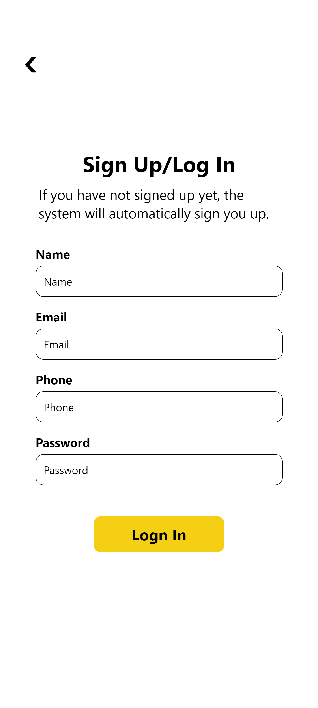
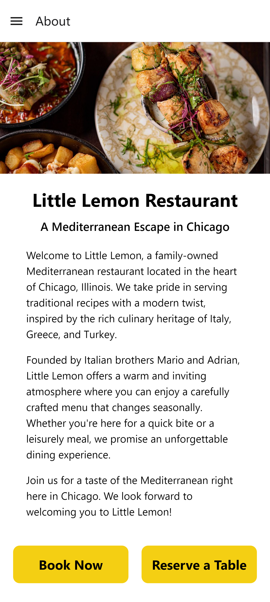
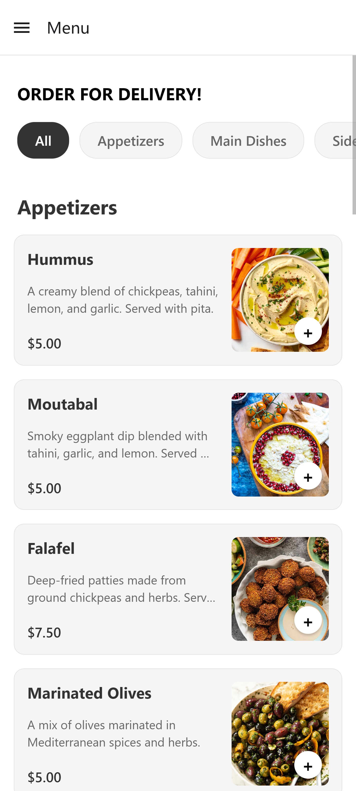
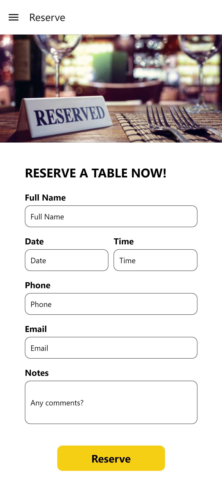
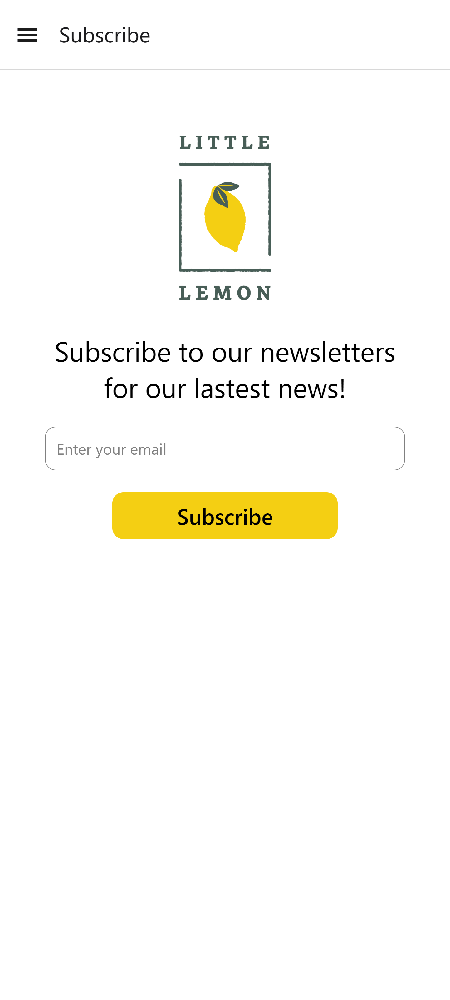
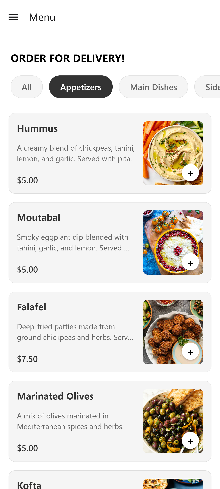
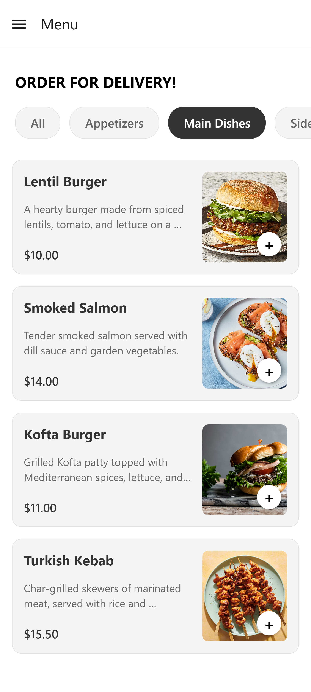
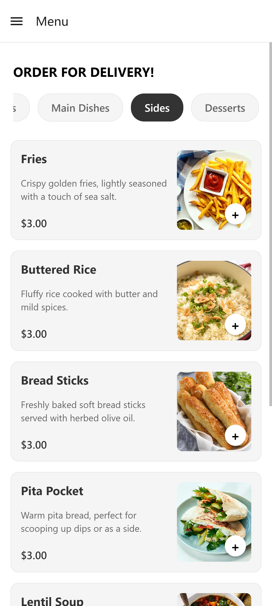
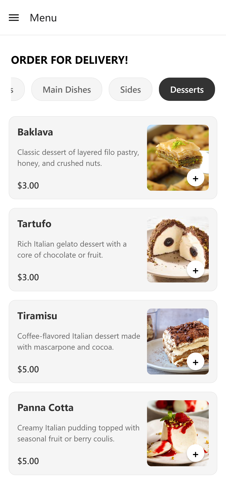

# Course 8: Capstone (React App)

Refer to the [course syllabus](./syllabus8.md).

Course 8 is a capstone project that showcases the knowledge and skills acquired throughout this course. The goal of this capstone project is to develop a comprehensive app for Little Lemon restaurant, encompassing features such as login, home, about, menu, and reservation.

Complete files refer to the [folder](./LittleLemon/).

## Preview

Here is the preview of the comprehensive Little Lemon app I made. Note that since there is no backend, this app mainly focuses on UI/UX.

1. First, the app has a welcome and sign up/log in page, and after logging in, this app uses drawer navigation:

<table>
    <tr>
        <td></td>
        <td></td>
        <td></td>
    </tr>
</table>


2. The app has About, Menu, Reserve, and Subscribe pages. 

<table>
    <tr>
        <td></td>
        <td></td>
        <td></td>
        <td></td>
    </tr>
</table>

3. The Menu page features a category tag that allows users to filter dishes by category.

<table>
    <tr>
        <td></td>
        <td></td>
        <td></td>
        <td></td>
    </tr>
</table>

3. The Menu page is scrollable since there are many menu items. Here is a complete view:

<table>
    <tr>
        <td></td>
    </tr>
</table>


## Installation/Usage

1. Clone this repo and switch to the LittleLemon folder: 
```
cd .\Course8\LittleLemon\
```

2. Install dependencies:
```
npm install
```

3. Run this project.
```
npm start
```
You can press `w` to preview on the web, or install the Expo app on your phone and scan the QR code to open the preview.
